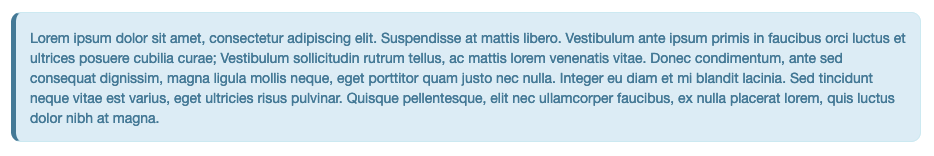

## Table of contents

.medium[
.pull-left[
1. Tips and Tricks
  - Child
  - `knitr::read_chunks()`
  - params
  - Figures & Tables
]

.pull-right[
**Output formats**

- Reports (`HTML`, `PDF`, `DOCX`, `GitHub Document`)
- Presentations (`xaringan`, `reveal.js`, `PPTX`)
- Scientific articles (`rticles`)
- Websites (`blogdown`, `distill`, `pkgdown`)
- Books (`bookdown`)
- Dashboards
- GitHub Pages (for HTML outputs)

**Bibliography**

- RStudio & Zotero
- Zotero styles
- `nocite: '@*'`

**Theming**

- Default themes
- Extensions
- Custom blocks

**Miscellaneous**

- Break list `<!-- end -->`
- Hard line break `\ `, `<br>`, `\newline`
]
]
---

## Chunks options

Usual way: 

````{r eval=FALSE}
```{r 'chunk-name', echo=FALSE, fig.width=10, fig.cap='This is a long long long long caption.'}

x <- 1 + 2
print(x)
```
````

```{r echo=FALSE}
x <- 1 + 2
print(x)
```

--

<br>

Alternatively:

````{r eval=FALSE}

```{r}
#| 'chunk-name',
#| echo = FALSE,
#| fig.width = 10,
#| fig.cap = 'This is a long long
#|   long long caption.'

x <- 1 + 2
print(x)
```
````


```{r echo=FALSE}
x <- 1 + 2
print(x)
```

.medium[`r fontawesome::fa_i("hand-point-right")` Quarto uses this syntax]

---

## Global chunks options

Do not repeat same chunk options values across all chunks. Use instead a general
chunk that will provide default values for all chunks.

````{r eval=FALSE}
```{r setup, include=FALSE}
knitr::opts_chunk$set(echo = FALSE, eval = TRUE, message = FALSE,
                      fig.width = 10, fig.height = 8, ...)
```
````

--

<br>

You will be able to change locally (for specific chunk) the default value:


````{r eval=FALSE}
```{r 'chunk-name', echo = TRUE}
1 + 3
```
````

```{r echo = TRUE}
1 + 3
```


---

## Rmd with others languages

.pull-left[
**R code** - `r fontawesome::fa_i("r-project")`

```{r echo=FALSE}
code_print <- c("```{r}", "", "", 
                "person <- \"Jane Doe\"",
                "paste0(\"Hello, \", person, \"!\")",
                "```")
```

```{r code=code_print, eval=FALSE}
```

```{r echo=FALSE}
person <- "Jane Doe"
paste0("Hello, ", person, "!")
```
]


---

## Rmd with others languages

.pull-left[
**R code** - `r fontawesome::fa_i("r-project")`

```{r echo=FALSE}
code_print <- c("```{r}", 
                "",
                "",
                "person <- \"Jane Doe\"",
                "paste0(\"Hello, \", person, \"!\")",
                "```")
```

```{r code=code_print, eval=FALSE}
```

```{r echo=FALSE}
person <- "Jane Doe"
paste0("Hello, ", person, "!")
```

**Bash code** - `r fontawesome::fa_i("code")`

```{r echo=FALSE}
code_print <- c("```{bash}", 
                "#| engine.path='/bin/bash'", "", 
                "person=\"Jane Doe\"",
                "echo \"Hello\"$person\"!\"",
                "```")
```

```{r code=code_print, eval=FALSE}
```

```{bash}
#| echo = FALSE,
#| engine.path='/bin/bash'

person="Jane Doe"
echo "Hello, "$person"!"
```
]

.pull-right[
**Python code** - `r fontawesome::fa_i("python")`

```{r echo=FALSE}
code_print <- c("```{python}", 
                "#| engine.path='/usr/local/bin/python3'", "", 
                "person <- \"Jane Doe\"",
                "f\"Hello, {person}!\"",
                "```")
```

```{r code=code_print, eval=FALSE}
```

```{python echo=FALSE, engine.path='/usr/local/bin/python3'}
person = "Jane Doe"
f"Hello, {person}!"
```

**Ruby on Rails code** - `r fontawesome::fa_i("code")`


```{r echo=FALSE}
code_print <- c("```{ruby}", 
                "#| engine.path='/usr/bin/ruby'", "", 
                "person = \"Jane Doe\"",
                "puts \"Hello, \" + person + \"!\"",
                "```")
```

```{r code=code_print, eval=FALSE}
```

```{ruby echo=FALSE, engine.path='/usr/bin/ruby'}
# Chunk option:
# {ruby, engine.path='/usr/bin/ruby'}

person = "Jane Doe"
puts "Hello, " + person + "!"
```
]

--

```{r}
Sys.which("python3")        ## Locate the Python3 engine (binary)
```


---

## Rmd with others languages

A smarter approach: use the global chunks options of `knitr`.

```{r 'set-engines', eval=FALSE}
## Global options ----
knitr::opts_chunk$set(engine.path = list(python = "/usr/local/bin/python3"))
```

--

<br/>

And then,


```{r echo=FALSE}
code_print <- c("```{python}", 
                "", 
                "person <- \"Jane Doe\"",
                "f\"Hello, {person}!\"",
                "```")
```

```{r code=code_print, eval=FALSE}
```

```{python echo=FALSE, engine.path='/usr/local/bin/python3'}
person = "Jane Doe"
f"Hello, {person}!"
```

---

## Resources

.medium[
- [**R Markdown Advanced Tips**](https://www.youtube.com/watch?v=WkF7nqEYF1E)
<br/>`r fontawesome::fa_i("hand-point-right")` Video by **Tom Mock**

- [**Meta RMarkdown - Taxonomy and Use cases**](https://themockup.blog/posts/2020-07-25-meta-rmarkdown/)
<br/>`r fontawesome::fa_i("hand-point-right")` Blogpost by **Tom Mock**

- [**R Markdown Cookbook**](https://bookdown.org/yihui/rmarkdown-cookbook/)
<br/>`r fontawesome::fa_i("hand-point-right")` Online book by **Yihui Xie et al.**

- [**R Markdown: The Definitive Guide**](https://bookdown.org/yihui/rmarkdown/)
<br/>`r fontawesome::fa_i("hand-point-right")` Online book by **Yihui Xie et al.**

- [**Dynamic Documents with R and knitr**](https://duhi23.github.io/Analisis-de-datos/Yihue.pdf)
<br/>`r fontawesome::fa_i("hand-point-right")` Online book by **Yihui Xie**

- [**blogdown: Creating Websites with R Markdown**](https://bookdown.org/yihui/blogdown/)
<br/>`r fontawesome::fa_i("hand-point-right")` Online book by **Yihui Xie et al.**

- [**bookdown: Authoring Books and Technical Documents with R Markdown**](https://bookdown.org/yihui/bookdown/)
<br/>`r fontawesome::fa_i("hand-point-right")` Online book by **Yihui Xie**
]


---

## Custom blocks

.pull-left[
**In the `.Rmd` file**

```
::: {.box-info}
Lorem ipsum dolor sit amet, consectetur adipiscing 
elit. Suspendisse at mattis libero. Vestibulum 
ante ipsum primis in faucibus...
:::
```
]

.pull-right[
**CSS style**
```css
div.box-info p {
  padding: 1em;
  margin: 20px 0;
  background: #DDECF6;
  border: 1px solid #CEE9F2;
  border-radius: 10px;
  color: #487997;
  border-left: 5px solid #487997;
}
```
]

<br>

.center[]

.medium[Example: <**https://github.com/rdatatoolbox/rmd-examples/custom-blocks/index.Rmd**>]
